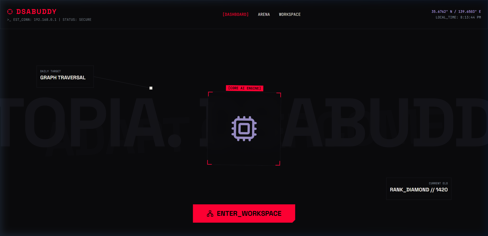
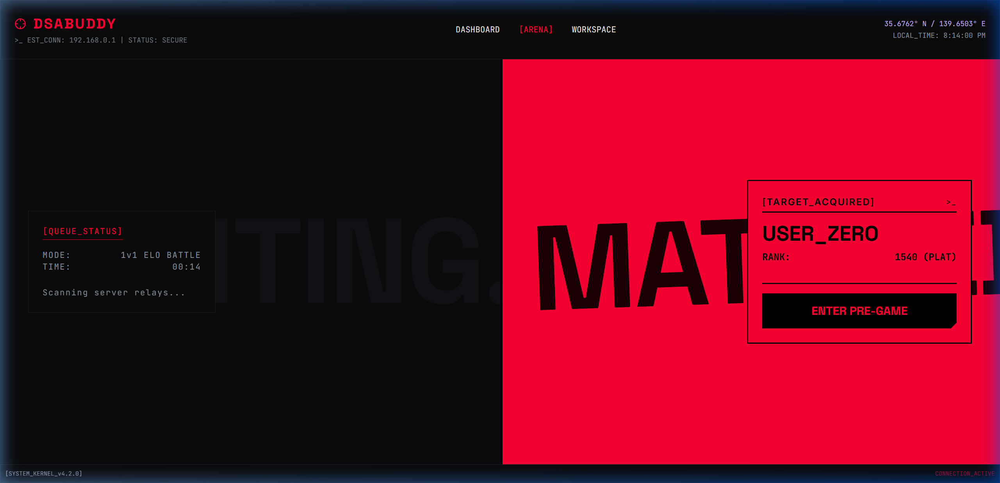
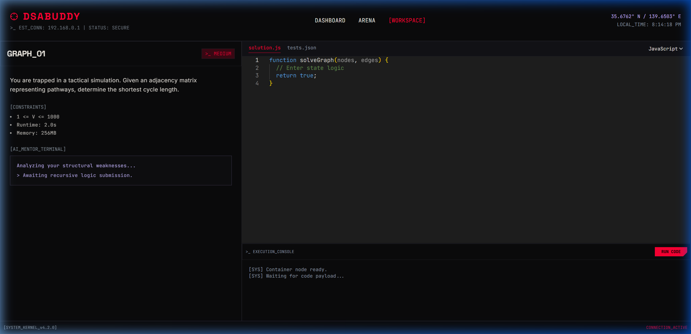

# DSABuddy - Tactical Practice Platform

A high-performance, scalable Data Structures and Algorithms (DSA) practice platform. The architecture features an AI-driven personalized learning loop, real-time ELO-based matchmaking, and a secure code execution environment. 

The application utilizes a brutalist-inspired UI, delivering a premium, eSports-like coding experience.

## System Architecture

* Frontend: Vite, React, Tailwind CSS V4, Framer Motion, Monaco Editor
* Backend: Node.js, Express, Socket.io
* Database: Supabase (PostgreSQL) Auth and Persistence
* Real-time: Topic-segmented matchmaking queues via WebSockets

## Platform Previews

### Landing & Onboarding

### Real-Time Matchmaking (Topic Queues)

### Live Execution Engine & AI Mentor

## Local Deployment Instructions

1. Install Frontend
cd frontend
npm install
npm run dev

2. Install Backend
cd backend
npm install
npx ts-node src/server.ts

Ensure that `VITE_SUPABASE_URL` and `VITE_SUPABASE_ANON_KEY` are populated in the frontend environment configuration before initializing.
