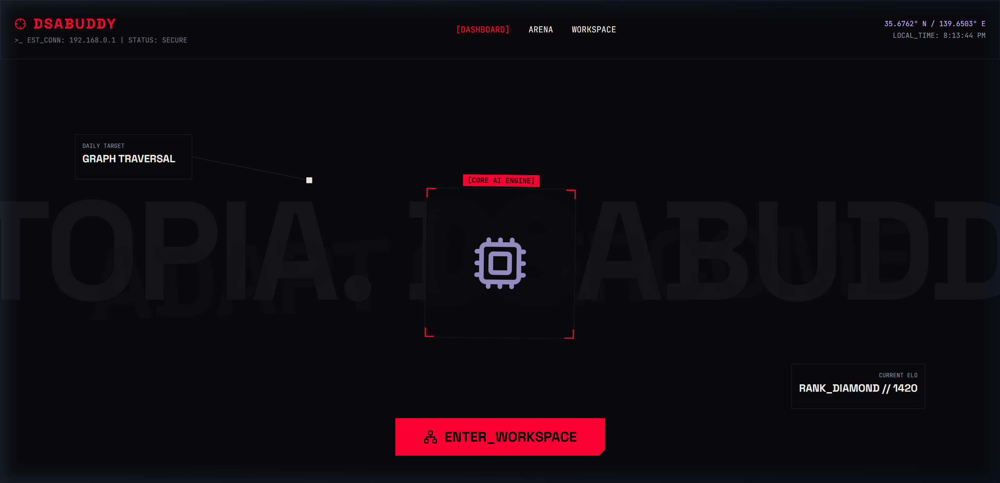
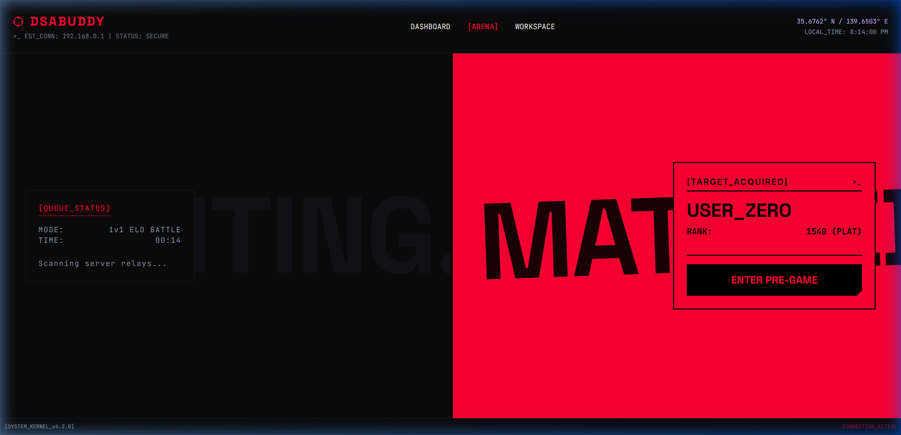
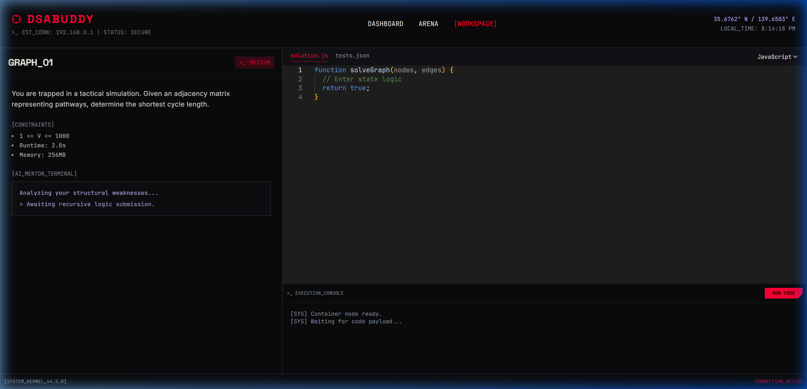

# DSADojo: Tactical Practice Platform

DSADojo is a high-performance Data Structures and Algorithms (DSA) training platform designed for competitive practice. It features a brutalist-inspired interface, real-time ELO-based matchmaking, and an integrated AI-driven learning loop.

## Core Features

### Real-Time Arena Matchmaking
A scalable matchmaking system using Socket.io to pair users based on topic proficiency and ELO rating. The system segments queues by algorithmic topics (Graphs, Arrays, Linked Lists, etc.) to ensure targeted practice.

### AI Mentor Integration
Powered by Google Gemini, the AI Mentor provides tactical hints and code reviews. It analyzes failed submissions to provide conceptual guidance without revealing direct solutions, simulating a real interview environment.

### Secure Workspace
A professional-grade coding environment integrated with the Monaco Editor. The architectural design supports isolated code execution with granular resource constraints.

## Technical Architecture

### Frontend
- **Framework**: React 18 with Vite for optimized build performance.
- **Styling**: Tailwind CSS V4 for a high-impact, minimalist aesthetic.
- **Animations**: Framer Motion for smooth state transitions and interface feedback.
- **Editor**: Monaco Editor for a VS Code-like development experience.

### Backend
- **Runtime**: Node.js with TypeScript.
- **Server**: Express.js REST API.
- **Real-time**: Socket.io for bidirectional communication and matchmaking state.
- **AI Engine**: Google Generative AI (Gemini 2.5) for intelligent feedback.

### Infrastructure & Persistence
- **Database**: Supabase (PostgreSQL) for user state and practice history.
- **Execution Strategy**: Designed for containerized isolation to ensure secure and deterministic runtime results.

## Platform Visuals

### Landing Interface


### Matchmaking Arena


### Development Workspace


## Installation and Setup

### Prerequisites
- Node.js (v18 or higher)
- npm or yarn
- Google Gemini API Key
- Supabase Project Credentials

### 1. Clone and Install Dependencies
```bash
git clone https://github.com/5kyscream/dsadjo.git
cd dsadojo
```

### 2. Configure Backend
Create a `.env` file in the `backend` directory:
```env
GEMINI_API_KEY=your_gemini_api_key
PORT=4000
```
Run the backend server:
```bash
cd backend
npm install
npm run dev
```

### 3. Configure Frontend
Create a `.env` file in the `frontend` directory:
```env
VITE_SUPABASE_URL=your_supabase_url
VITE_SUPABASE_ANON_KEY=your_supabase_anon_key
VITE_BACKEND_URL=http://localhost:4000
```
Run the development server:
```bash
cd frontend
npm install
npm run dev
```

## Security & Performance
The platform utilizes JWT-based authentication via Supabase and implements rate-limiting on both the API Gateway and WebSocket layers. Code execution is designed to run in isolated sandboxes to prevent host resource compromise.
