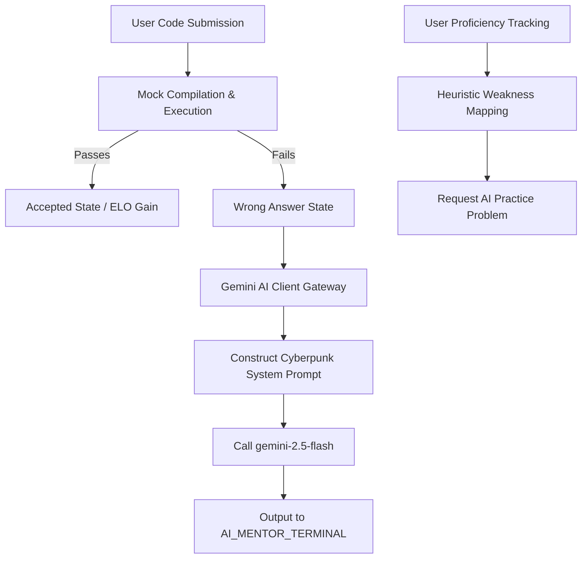

# DSADojo: AI & Machine Learning Architectures

This document provides a comprehensive overview of the Artificial Intelligence (AI) and Machine Learning (ML) functionalities implemented within the DSADojo platform. 

---

## Architecture Overview

DSADojo leverages a hybrid approach to AI/ML:
1. **Generative AI Mentorship (Real-Time)**: Utilizes LLMs (Google Gemini API) to provide context-aware, cyberpunk-themed logic hints when code submissions fail.
2. **Dynamic Heuristics (Practice Dispenser)**: An in-memory analytics engine that monitors topic performance metrics to serve targeted practice problems.
3. **Concept Transformer Model (Future Integration)**: A custom PyTorch-based neural sequence model designed to predict topic weaknesses and deliver deep-learning-driven practice feeds.



---

## 1. Real-Time Generative AI Mentorship

The generative AI component acts as an immersive, real-time mentor that guides users through challenging problems without giving away the direct answers.

### Implementation Details
* **Technology**: Built using `@google/genai` (Node.js) targeting the `gemini-2.5-flash` model.
* **Source Entry Point**: [server.ts:L129-L147](file:///d:/DSAbuddy/backend/src/server.ts#L129-L147)
* **Frontend Terminal**: [Workspace.tsx:L205-L211](file:///d:/DSAbuddy/frontend/src/components/Workspace.tsx#L205-L211)

### The Prompting Strategy
When code fails compilation or execution, the system wraps the code and problem constraints into a highly specific system prompt:

```text
You are an elite Cyberpunk DSA mentor logging into the mainframe. 
The user submitted this code for the problem "[Problem Title]" (Topic: [Topic]).

Problem Description: [Description]
Constraints: [Constraints]
User's Code: [Code]

INSTRUCTIONS:
1. If the code contains blatant syntax errors, reference errors, or gibberish, 
   call out the exact syntax failure in a strict cyberpunk tone.
2. Otherwise, if the logic is just flawed, provide exactly ONE concise hint 
   (max 2 sentences) to point them in the right direction.

Do NOT write the code answer for them under any circumstances. Keep the tone sharp and professional.
```

### Communication Protocol
The system uses WebSockets for minimal latency:
* **Event sent (`SUBMIT_CODE`)**: Sends code, problem ID, user ID, and time spent.
* **Event received (`AI_MENTOR_HINT`)**: Broadcasts the returned text from Gemini to the user's localized console window.

---

## 2. Dynamic Performance Heuristics (AI Practice Dispenser)

Before routing users to heavy ML endpoints, the backend leverages heuristic profiling to evaluate user stats instantly.

### Implementation Details
* **Source Entry Point**: [server.ts:L69-L96](file:///d:/DSAbuddy/backend/src/server.ts#L69-L96)
* **Logic**:
  1. The user profile is stored under `userProficiency` with attempts and total execution time tracked per topic category (`GRAPHS`, `DYNAMIC_PROGRAMMING`, `ARRAYS`, `TREES`, `LINKED_LISTS`, `STRINGS`).
  2. The system computes average time (`totalTime / attempts`) for each topic.
  3. Untried topics are prioritized first to resolve cold start issues.
  4. If all topics have records, it selects the topic with the highest average completion time (worst performance) and dispenses a matching problem template.

---

## 3. Custom PyTorch Concept Transformer (ML Prototype)

To upgrade the heuristic practice dispenser into a deep-learning recommendation engine, the platform includes a prototype PyTorch sequence model.

### Model Architecture
* **Source Entry Point**: [recommender.py](file:///d:/DSAbuddy/src/ai/recommender.py)
* **Class Definition**: [ConceptTransformer](file:///d:/DSAbuddy/src/ai/recommender.py#L25-L40)

```python
class ConceptTransformer(nn.Module):
    def __init__(self, vocab_size=1000, embed_size=128):
        super(ConceptTransformer, self).__init__()
        self.embedding = nn.Embedding(vocab_size, embed_size)
        self.transformer = nn.TransformerEncoderLayer(d_model=embed_size, nhead=4)
        self.fc = nn.Linear(embed_size, vocab_size)

    def forward(self, x):
        embedded = self.embedding(x)
        out = self.transformer(embedded)
        return self.fc(out.mean(dim=1))
```

### Key Components
1. **Embedding Layer**: Translates categorical sequence histories of user attempts into high-dimensional embedding spaces (`embed_size=128`).
2. **Transformer Encoder Layer**: Uses multi-head self-attention mechanisms (4 heads) to compute contextual dependencies between topics solved in succession (capturing temporal difficulty slopes and recurring bugs).
3. **Linear Layer (FC)**: Map output features back to prediction logits over the vocabulary size (recommending the optimal target topic).

### API Endpoint
The FastAPI microservice maps prediction requests through:
* **Route**: `/ai/mentorship/recommend` (POST)
* **Request Schema (`UserPerformanceData`)**:
  * `user_id`: String identifier.
  * `recent_attempts`: Sequence array of topic attempt payloads.
  * `current_elo`: Numeric rating band representation.
* **Response Schema (`RecommendationResponse`)**:
  * `recommended_problem_ids`: Ranked list of curated problems.
  * `identified_weakness`: String description of the concept gap.
  * `rationale`: Explainable AI description of the model output.
